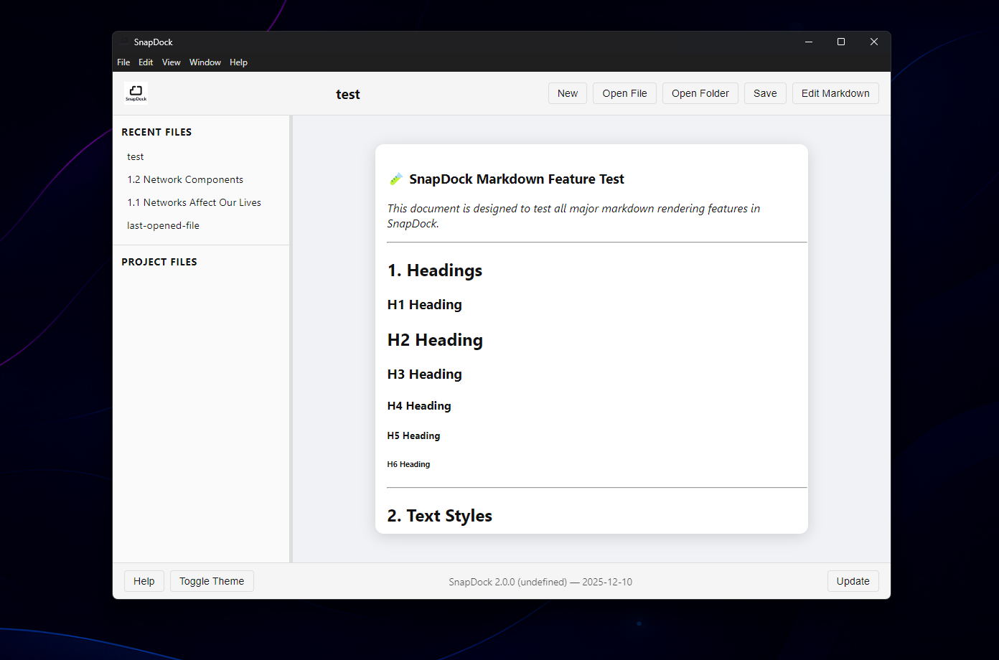

<p align="center">
  
</p>

<p align="center">
   <strong>Clean, stable, long‑term Markdown editing</strong><br/>
   Built by <strong>ZFordDev</strong>
</p>

---

### 🌐 Official Website  
[https://snapdock.app](https://snapdock.app)

---

## **Overview**

SnapDock is a lightweight Markdown editor built with Electron and powered by **markdown‑it**. It delivers a clean, modern writing experience with a layout inspired by professional editors — but without the bloat. The interface feels closer to a traditional word processor, making it approachable for everyday writing while still supporting full Markdown syntax.

SnapDock is designed to be fast, minimal, and distraction‑free. It stays out of your way so you can focus on your notes, documents, and projects.

---

## 🛡️ **Long‑Term Support (LTS)**

SnapDock is a **Long‑Term Support (LTS)** application.

The current architecture, framework choices, and core design are considered **stable and complete**. Future updates focus exclusively on:

- Bug fixes  
- Security patches  
- Performance improvements  
- Minor quality‑of‑life refinements  

SnapDock will **not** undergo major rewrites, framework migrations, or experimental feature additions. This ensures:

- Predictable behavior  
- Long‑term reliability  
- Consistent performance  
- Trust for users who rely on SnapDock daily  

If you want a Markdown editor that won’t shift under your feet, SnapDock is built for exactly that.

---

## 📁 Project Structure

```
SnapDock/
│
├── main.js                 # Electron main process
├── preload.js              # Secure API bridge
├── index.html              # App shell
├── package.json
│
├── assets/                 # Icons, banners, screenshots
│
├── src/
│   ├── modules/
│   │   ├── ui/             # UI logic (themes, view mode, editor sync)
│   │   ├── file/           # File handling (open, save, tabs, workspace)
│   │   ├── system/         # Updater + system utilities
│   │   └── markdown.js     # Markdown rendering engine
│   │
│   └── styles/
│       ├── base/           # Reset + layout
│       ├── components/     # Editor, tabs, sidebar, footer
│       ├── markdown/       # Highlighting + markdown styling
│       └── themes/         # Light, Dark, Solarized, Arctic
```

---

## 🚫 **Why SnapDock Avoids Node.js in the Renderer**

Although SnapDock is built with Electron, it **intentionally avoids Node.js APIs in the renderer process**.

This is a deliberate architectural choice.

By relying on **pure HTML, CSS, and browser‑standard JavaScript**, SnapDock benefits from:

- Lower memory usage  
- Faster startup times  
- A smaller runtime footprint  
- Reduced attack surface  
- Fewer long‑term dependencies  

Most Electron apps tightly couple their UI to Node.js, which increases complexity and memory overhead. SnapDock instead treats Electron as a **lightweight desktop shell**, allowing the app to behave like a self‑contained offline web app.

This approach directly supports SnapDock’s LTS philosophy: stable, predictable, and easy to maintain for years.

---

# **Download & Install**

SnapDock is available as a full desktop application.

---

### **1. GitHub Releases (Recommended)**

Download the latest Windows installer:

**`https://github.com/ZFordDev/SnapDock/releases` [(github.com)](https://www.bing.com/search?q="https%3A%2F%2Fgithub.com%2FZFordDev%2FSnapDock%2Freleases")**

---

### **2. Build From Source**

```bash
npm install
npm run build
```

This produces a packaged build identical to the official release.

---

### **Other Platforms**

macOS and Linux builds are planned and will be added after cross‑platform testing.

---

## **Screenshots**

<table>
  <tr>
      <td align="center">
      
      <br/>
      <em>2026 (LTS) — Light theme</em>
    </td>
    <td align="center">
      
      <br/>
      <em>2026 (LTS) — Arctic Dark</em>
    </td>
    <td align="center">
      
      <br/>
      <em>Live preview — Light theme</em>
    </td>
    <td align="center">
      
      <br/>
      <em>Editor view — Dark theme</em>
    </td>
    <td align="center">
      
      <br/>
      <em>The original V1 design</em>
    </td>
  </tr>
</table>

---

# ✅ **Features**

- Modern Markdown rendering (tables, code blocks, callouts, footnotes, etc.)  
- Integrated file‑tree dock for navigating `.md` folders  
- **Four themes** with a clean drop‑up selector  
- Stable tabbed editing  
- Recent files with workspace‑aware history  
- Minimal, distraction‑free interface  
- Theme‑accurate live preview  
- PDF export  
- Automatic update checker  
- Workspace auto‑loading on startup  

---

# ⚠️ **Known Issues**

1. **PDF export:** Fully functional, but advanced layout tuning is still planned  
2. **macOS builds:** Packaging and testing in progress  
3. **Linux (.deb):** Stable; broader Linux packaging (Snap/AppImage/Flatpak) is no longer planned  
4. **File‑tree edge cases:** Rapid switching may override unsaved changes in rare cases  

---

## 🔧 **Maintenance & Stability**

SnapDock is actively maintained with a focus on:

- Stability  
- Bug fixes  
- Performance tuning  
- Platform compatibility  

Major feature expansion is intentionally limited to preserve SnapDock’s LTS identity.

---

### **Recent Changes**

- Fixed update pipeline issue introduced in 2.2.2  
- Marked SnapDock as **Stable** and introduced Stable / Pre‑release channels  
- Updated platform distribution: Windows (.exe) and Linux (.deb) fully supported; AppImage removed  

---

## **Contribute**

Contributions are welcome:

- **Pull Requests:** Features, fixes, refactors  
- **Issues:** Bugs, suggestions, questions  

Thanks for taking the time to explore the project.

---

## **License**

MIT License — free to use, modify, and share.  
Please keep the original notice.

---

# ⭐ **SnapDock‑Pro (Coming Later)**

SnapDock‑Pro is a **separate, advanced feature edition** currently in development.

While SnapDock remains stable and LTS‑focused, SnapDock‑Pro explores advanced capabilities that require a different architecture.

Planned areas include:

### **Social Collaboration**
- Offline local‑network collaboration  
- Optional online linking via SnapDock services  
- Shared documents, projects, and workspaces  

### **AI‑Assisted Writing**
- Document summarisation  
- Structural cleanup and clarity improvements  
- Context‑aware document discovery  

### **Real‑Time Interaction**
- Messaging between linked collaborators  
- Cooperative editing workflows  
- Project‑level awareness across documents  

These features are intentionally **not** part of the LTS edition.

**SnapDock will remain free, lightweight, and stable.  
SnapDock‑Pro exists for users who need collaboration and AI‑enhanced workflows.**

---

## **Explore More**

More tools and projects:  
[https://zford.dev](https://zford.dev)

---
